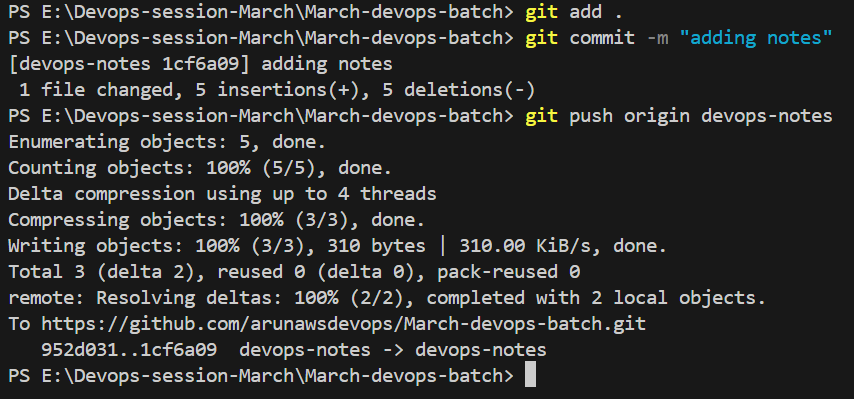
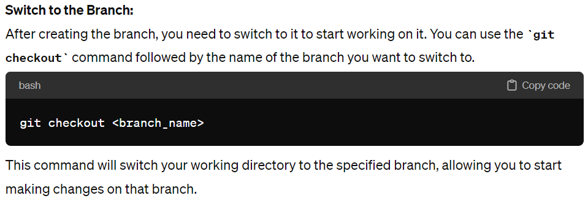

# GitHub and Git: A Comprehensive Guide for Students

## Introduction to Git

Git is a distributed version control system (VCS) designed to manage source code history and facilitate collaboration among developers. It allows users to track changes to files, revert to previous versions, and work on different features concurrently.

## SCM and Version Control System

Git is a type of Source Code Management (SCM) system and a version control system. SCM systems like Git help manage changes to source code over time, enabling collaboration, tracking modifications, and ensuring the integrity of the codebase.

## Key Concepts:

### Commit

A commit is a fundamental operation in Git. It represents a snapshot of changes made to files in the repository at a specific point in time. Each commit has a unique identifier (SHA-1 hash), a commit message describing the changes, and references to parent commits.

### Push Operation

Pushing is the process of uploading local repository changes to a remote repository, such as GitHub or another Git hosting service. It allows collaborators to access and review your changes and contributes to the shared project history.

Example:

#### Command to Push

To push changes to a remote repository:

git push <remote_name> <branch_name>

### Pull Operation

Pulling is the process of downloading changes from a remote repository to a local repository. It updates your local repository with changes made by others, ensuring synchronization with the latest project state.

#### Command to Pull

To pull changes from a remote repository:

git pull <remote_name> <branch_name>

### Branches

Branches in Git are independent lines of development that allow you to work on features, fixes, or experiments without affecting the main codebase. The main branch (often named "master" or "main") represents the stable version of the project.

#### Main Branch and Feature Branches

- **Main Branch:** The primary branch of the repository, typically containing the most stable version of the code. It serves as the baseline for other branches.

- **Feature Branches:** Branches created to work on specific features or changes. They are derived from the main branch and merged back once the feature is complete.

#### Commands Related to Branches

- **Create Branch:**

- **switch to a Branch:**

