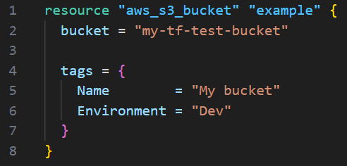

# Terraform: A Student's Quick Guide

## What is Terraform?

Terraform is an open-source infrastructure as code software tool created by HashiCorp. It allows users to define and provision data center infrastructure using a high-level configuration language known as HashiCorp Configuration Language (HCL) or optionally JSON.

## Why Terraform?

- **Infrastructure as Code (IaC):** Terraform enables the management of infrastructure through code, enhancing reproducibility, versioning, and collaboration among team members.

- **Multi-Cloud Support:** It supports multiple cloud providers like AWS, Azure, Google Cloud, and others, enabling users to deploy resources across different platforms using the same configuration.

- **Resource Graph:** Terraform builds an execution plan by analyzing the dependencies between resources, ensuring optimal resource provisioning and reducing deployment errors.

- **Immutable Infrastructure:** Terraform promotes the creation of immutable infrastructure, where changes are made by provisioning entirely new resources rather than modifying existing ones, enhancing reliability and stability.

- **Community Support:** With a large community of users and contributors, Terraform benefits from continuous improvement, extensive documentation, and a wealth of third-party modules and plugins.

## Terraform Blocks

1. **Provider Block:** Specifies the cloud provider or service used for resource provisioning. Example: `provider "aws" {}`.

Example: 

2. **Resource Block:** Defines the infrastructure resources to be provisioned, such as virtual machines, storage buckets, or networking components. Example: `resource "aws_instance" "example" {}`.

Example: 

- `<provider_type>`: Specifies the type of provider that Terraform should use to create the resource. This could be "aws", "azurerm", "google", etc., depending on the cloud provider you're working with.

- `<resource_name>`: This is a local name for the resource block, used to reference the resource within your Terraform configuration.

3. **Data Block:** Retrieves information from external sources or existing infrastructure to be used within the Terraform configuration. Example: `data "aws_ami" "example" {}`.

4. **Variable Block:** Declares input variables used within the configuration to make it more dynamic and reusable. Example: `variable "region" {}`.

5. **Output Block:** Defines values to be exposed after resource provisioning for reference or sharing with other configurations. Example: `output "instance_ip" {}`.

## Terraform Variables

- **Input Variables:** Used to parameterize Terraform configurations, allowing users to customize deployments based on different environments or requirements.

- **Variable Declaration:** Variables are declared using the `variable` block, specifying the variable name, type, and optional default value.

- **Variable Assignment:** Values for variables can be assigned using command-line flags, environment variables, or variable files.

- **Variable Interpolation:** Variables can be interpolated within the configuration using syntax like `${var.example}` to dynamically reference their values.
